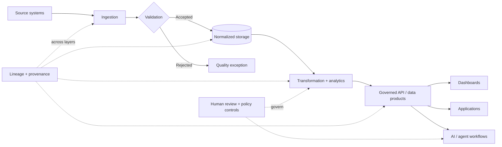
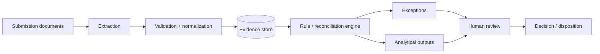

# Data Architecture Project

### Data Architecture · Governance · AI-Ready Systems

**A reference architecture for building governed analytical pipelines and AI-ready decision systems with explicit validation, lineage, interfaces, and human-review boundaries.**

[Portfolio](https://github.com/JJennings728/ZipSmart360/blob/main/PORTFOLIO.md) · [Working reference](https://github.com/JJennings728/ZipSmart360)

## Objective

This repository documents the architectural pattern I use to reason about information systems: how source data moves through ingestion, validation, normalized storage, analytical logic, governed interfaces, and downstream applications.

The goal is not to make the model the system of record. The goal is to make the **data, rules, transformations, evidence, and review boundaries inspectable**.

## Reference architecture



## Design priorities

- **Data contracts** — expected structure and semantics are explicit.
- **Validation before use** — bad inputs should fail before they contaminate downstream systems.
- **Normalized storage** — source records and analytical entities remain distinguishable.
- **Traceable transformations** — outputs can be traced back to inputs and rules.
- **Governed interfaces** — APIs and data products expose deliberate, bounded behavior.
- **Lineage and provenance** — source, transformation, version, and review history are retained.
- **Reproducibility** — analytical results can be regenerated from known inputs.
- **Human review** — high-impact decisions retain explicit accountability.
- **AI-ready boundaries** — models consume governed context rather than becoming the source of truth.

## Implemented reference

The strongest executable example of these principles is [ZIPSmart360](https://github.com/JJennings728/ZipSmart360).

| Architecture concern | Implemented example |
| --- | --- |
| Ingestion | Structured CSV input |
| Validation | Field, range, uniqueness, and identifier checks |
| Storage | SQLite with constraints and indexing |
| Transformation | Explicit SQL and Python build logic |
| Outputs | Reproducible CSV, JSON, and HTML artifacts |
| Access layer | Local read-only JSON API |
| Verification | Automated tests for data quality and API behavior |
| Documentation | Architecture notes and data dictionary |

## How to use this repository

This repository is an **architecture and planning repository**, not a standalone deployable application.

### Clone for review

```bash
git clone https://github.com/JJennings728/data-architecture-project.git
cd data-architecture-project
```

No package installation or runtime service is required for the repository itself.

### Run the working reference implementation

```bash
git clone https://github.com/JJennings728/ZipSmart360.git
cd ZipSmart360

python -m unittest discover -s tests -v
python zipsmart.py
python server.py
```

Open:

```text
http://127.0.0.1:8000
```

## Relationship to AI systems

Reliable AI applications depend on reliable information boundaries.

This architecture separates:

```text
source data
→ validated facts
→ normalized entities
→ analytical rules
→ governed context
→ model behavior
→ human decision
```

That separation makes it possible to inspect what came from a source, what was calculated, what was inferred, and what ultimately required human judgment.

## Example extension: insurance decision support

The same pattern can support insurance and aviation workflows:



This is a reference pattern, not a claim of a deployed carrier system.

## Portfolio applications

The broader portfolio applies these architecture principles to:

- geographic analytics;
- insurance AI workflow design;
- commercial CAT exposure cleansing;
- facultative reinsurance pricing;
- aviation underwriting analytics; and
- regulatory and evidence-backed decision support.

[View the full Applied AI, Risk Analytics & Data Engineering portfolio](https://github.com/JJennings728/ZipSmart360/blob/main/PORTFOLIO.md)

## Status and limitations

**Planning and architecture repository.**

This repository does not represent deployed infrastructure or a production data platform. Implementation evidence is maintained in ZIPSmart360 and related portfolio artifacts.

## Author

**James Jennings**  
Applied AI · Risk Analytics · Data Engineering · Insurance

[LinkedIn](https://www.linkedin.com/in/james-jennings-2053b4a8) · [GitHub](https://github.com/JJennings728)
